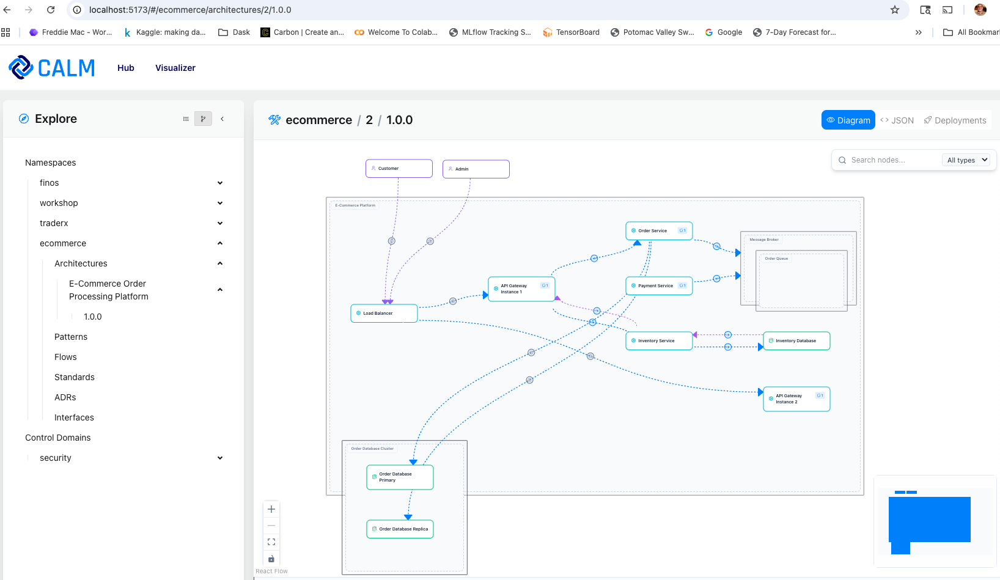
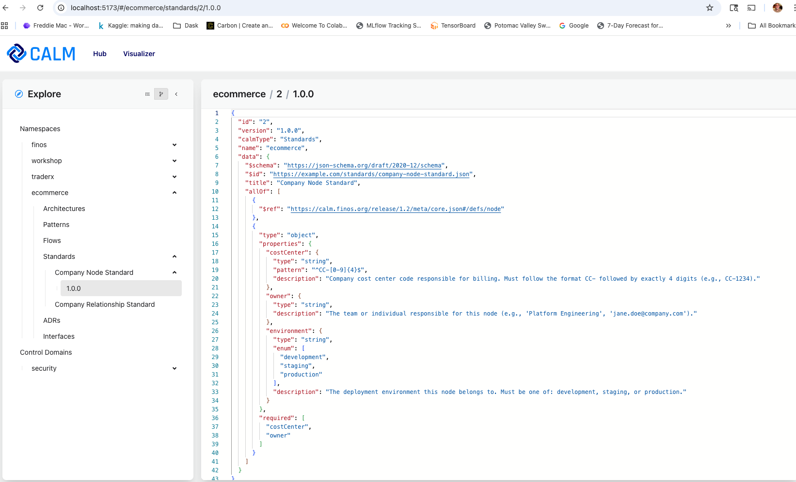
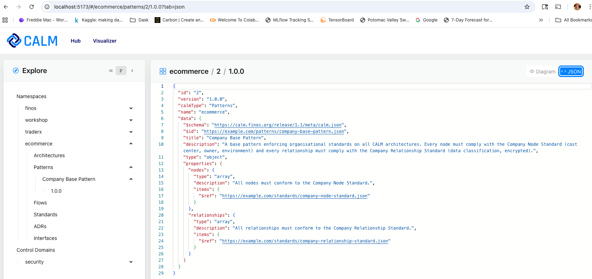

# Demonstration of CALM HUB Integration

Using results from the `Beginner` and `Intermediate` tutorials, demonstrate using CALM Hub Server to store the artifacts.

## What `calm-hub-cli` cli Is 

At the moment the name `calm-hub` has two meanings. One is the server component that houses architecture artifacts. The other meaning is for a cli that interacts with the server component. For purposes of this README, the primary meaning will be in the context of the cli command `calm-hub-cli`.

`calm-hub-cli` is the command-line interface used in this demo to send requests to a local CALM Hub server. In this repository it is provided by the package in [`../utilities/`](../utilities), where the executable is exposed through the package `bin` entry after the CLI is built.

You can use `calm-hub-cli` as a shorthand for running the built CLI directly, which makes it convenient for demo flows like creating namespaces, uploading architectures, patterns, and standards, and listing the resources stored in CALM Hub.

## CALM Hub Server Screenshots

### Architecture



### Standards



### Patterns



## Demonstration Script
[setup-ecommerce-demo.sh](setup-ecommerce-demo.sh)

```
$ ./demo/setup-ecommerce-demo.sh 
```

## Example Output

```


$ calm-hub-cli namespaces list
Next: list namespaces
{
  "values": [
    {
      "name": "finos",
      "description": "FINOS namespace"
    },
    {
      "name": "workshop",
      "description": "Workshop namespace"
    },
    {
      "name": "traderx",
      "description": "TraderX namespace"
    }
  ]
}

$ calm-hub-cli namespaces create --name "ecommerce" --description "Ecommerce demo"
Next: create namespace ecommerce
{
  "ok": true,
  "action": "namespaces.create",
  "status": 201,
  "path": "/calm/namespaces",
  "location": "http://localhost:8080/calm/namespaces/ecommerce",
  "data": null
}

$ calm-hub-cli namespaces list
Next: list namespaces
{
  "values": [
    {
      "name": "finos",
      "description": "FINOS namespace"
    },
    {
      "name": "workshop",
      "description": "Workshop namespace"
    },
    {
      "name": "traderx",
      "description": "TraderX namespace"
    },
    {
      "name": "ecommerce",
      "description": "Ecommerce demo"
    }
  ]
}

$ calm-hub-cli architectures create --namespace "ecommerce" --file "$REPO_ROOT/architectures/ecommerce-platform.json"
Next: create architecture ecommerce-platform in namespace ecommerce
{
  "ok": true,
  "action": "architectures.create",
  "status": 201,
  "path": "/calm/namespaces/ecommerce/architectures",
  "location": "http://localhost:8080/calm/namespaces/ecommerce/architectures/2/versions/1.0.0",
  "data": null
}

$ calm-hub-cli patterns create --namespace "ecommerce" --file "$REPO_ROOT/patterns/company-base-pattern.json" --name "Company Base Pattern" --description "A base pattern enforcing organisational standards on all CALM architectures. Every node must comply with the Company Node Standard (cost center, owner, environment) and every relationship must comply with the Company Relationship Standard (data classification, encrypted)."
Next: create pattern Company Base Pattern in namespace ecommerce
{
  "ok": true,
  "action": "patterns.create",
  "status": 201,
  "path": "/calm/namespaces/ecommerce/patterns",
  "location": "http://localhost:8080/calm/namespaces/ecommerce/patterns/2/versions/1.0.0",
  "data": null
}

$ calm-hub-cli standards create --namespace "ecommerce" --file "$REPO_ROOT/standards/company-node-standard.json" --name "Company Node Standard" --description "Defines required node metadata including cost center, owner, and environment constraints for CALM nodes."
Next: create standard Company Node Standard in namespace ecommerce
{
  "ok": true,
  "action": "standards.create",
  "status": 201,
  "path": "/calm/namespaces/ecommerce/standards",
  "location": "http://localhost:8080/calm/namespaces/ecommerce/standards/2/versions/1.0.0",
  "data": null
}

$ calm-hub-cli standards create --namespace "ecommerce" --file "$REPO_ROOT/standards/company-relationship-standard.json" --name "Company Relationship Standard" --description "Defines required relationship metadata including data classification and encryption requirements for CALM relationships."
Next: create standard Company Relationship Standard in namespace ecommerce
{
  "ok": true,
  "action": "standards.create",
  "status": 201,
  "path": "/calm/namespaces/ecommerce/standards",
  "location": "http://localhost:8080/calm/namespaces/ecommerce/standards/3/versions/1.0.0",
  "data": null
}

$ calm-hub-cli architectures list --namespace "ecommerce"
Next: list architectures in namespace ecommerce
{
  "values": [
    {
      "description": "End-to-end order processing platform for e-commerce, covering order placement, inventory management, and payment processing",
      "id": 2,
      "name": "E-Commerce Order Processing Platform"
    }
  ]
}

$ calm-hub-cli patterns list --namespace "ecommerce"
Next: list patterns in namespace ecommerce
{
  "values": [
    {
      "description": "A base pattern enforcing organisational standards on all CALM architectures. Every node must comply with the Company Node Standard (cost center, owner, environment) and every relationship must comply with the Company Relationship Standard (data classification, encrypted).",
      "id": 2,
      "name": "Company Base Pattern"
    }
  ]
}

$ calm-hub-cli standards list --namespace "ecommerce"
Next: list standards in namespace ecommerce
{
  "values": [
    {
      "description": "Defines required node metadata including cost center, owner, and environment constraints for CALM nodes.",
      "id": 2,
      "name": "Company Node Standard"
    },
    {
      "description": "Defines required relationship metadata including data classification and encryption requirements for CALM relationships.",
      "id": 3,
      "name": "Company Relationship Standard"
    }
  ]
}
```
