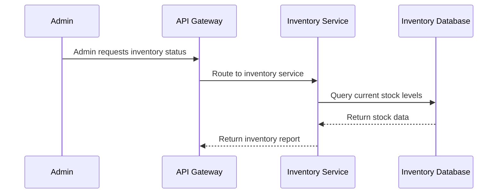

# Inventory Stock Check

## Details

    <table>
        <tbody>
        <tr>
            <th>Unique Id</th>
            <td>inventory-check-flow</td>
        </tr>
        <tr>
            <th>Name</th>
            <td>Inventory Stock Check</td>
        </tr>
        <tr>
            <th>Description</th>
            <td>Admin checks and updates inventory stock levels</td>
        </tr>
        </tbody>
    </table>

## Sequence Diagram

## Controls
_No controls defined._

## Metadata

No metadata defined.

