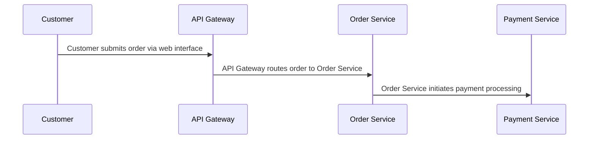

# Customer Order Processing

## Details

    <table>
        <tbody>
        <tr>
            <th>Unique Id</th>
            <td>order-processing-flow</td>
        </tr>
        <tr>
            <th>Name</th>
            <td>Customer Order Processing</td>
        </tr>
        <tr>
            <th>Description</th>
            <td>End-to-end flow from customer placing an order to payment confirmation</td>
        </tr>
        </tbody>
    </table>

## Sequence Diagram

## Controls
### Audit

All order processing steps must be logged for audit compliance

    <table>
        <thead>
        <tr>
            <th>Key</th>
            <th>Value</th>
        </tr>
        </thead>
        <tbody>
        <tr>
            <td><b>0</b></td>
            <td>
                <table class="nested-table">
                        <tbody>
                        <tr>
                            <td><b>Requirement Url</b></td>
                            <td>
                                https://internal-policy.example.com/audit/transaction-logging
                                    </td>
                        </tr>
                        <tr>
                            <td><b>Log Level</b></td>
                            <td>
                                detailed
                                    </td>
                        </tr>
                        <tr>
                            <td><b>Retention Days</b></td>
                            <td>
                                365
                                    </td>
                        </tr>
                        </tbody>
                    </table>
            </td>
        </tr>
        </tbody>
    </table>

## Metadata

No metadata defined.

