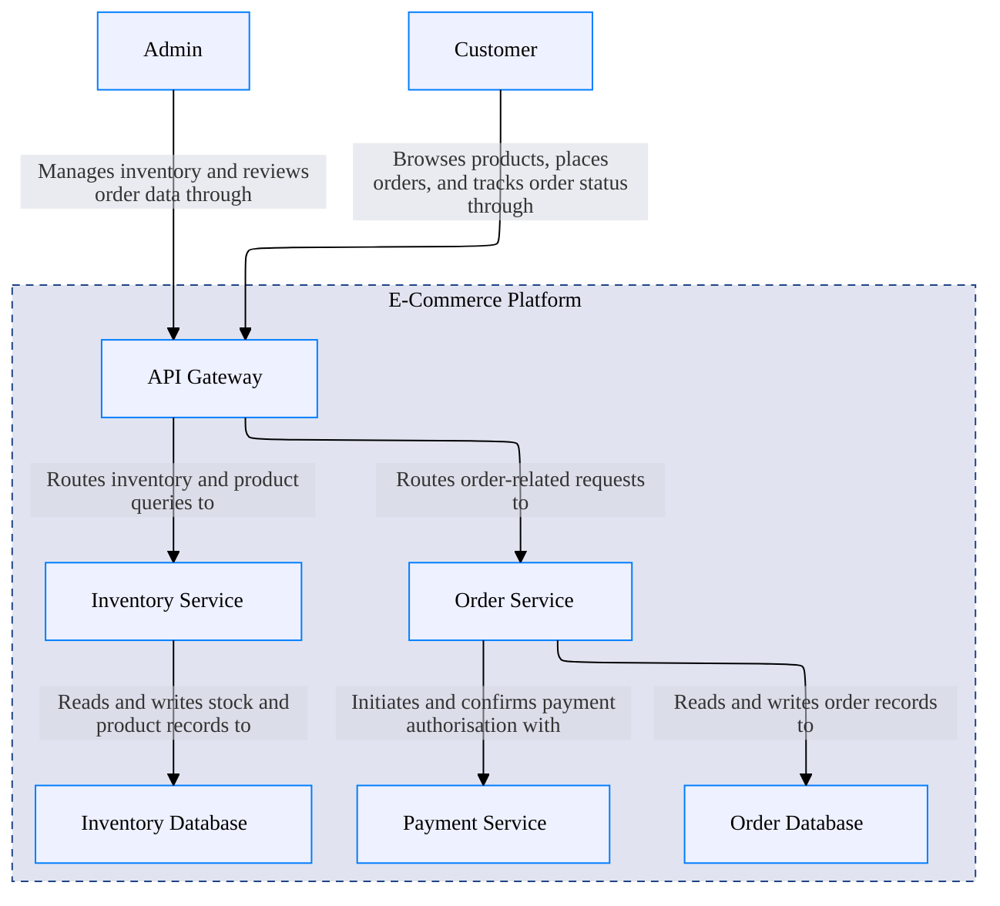

# Welcome to CALM Documentation

This documentation is generated from the **CALM Architecture-as-Code** model.

## High Level Architecture

## Nodes
- [Customer](nodes/customer)
- [Admin](nodes/admin)
- [API Gateway](nodes/api-gateway)
- [Order Service](nodes/order-service)
- [Inventory Service](nodes/inventory-service)
- [Payment Service](nodes/payment-service)
- [Order Database](nodes/order-database)
- [Inventory Database](nodes/inventory-database)
- [E-Commerce Platform](nodes/ecommerce-platform)

## Relationships
- [Customer Uses Platform](relationships/customer-uses-platform)
- [Admin Uses Platform](relationships/admin-uses-platform)
- [Api Gateway To Order Service](relationships/api-gateway-to-order-service)
- [Api Gateway To Inventory Service](relationships/api-gateway-to-inventory-service)
- [Order Service To Payment Service](relationships/order-service-to-payment-service)
- [Order Service To Order Db](relationships/order-service-to-order-db)
- [Inventory Service To Inventory Db](relationships/inventory-service-to-inventory-db)
- [Ecommerce Platform Composed Of Services](relationships/ecommerce-platform-composed-of-services)

## Flows
- [Customer Order Processing](flows/order-processing-flow)
- [Inventory Stock Check](flows/inventory-check-flow)

## Metadata

    <table>
        <thead>
        <tr>
            <th>Key</th>
            <th>Value</th>
        </tr>
        </thead>
        <tbody>
        <tr>
            <th>Owner</th>
            <td>platform-team@example.com</td>
        </tr>
        <tr>
            <th>Version</th>
            <td>1.0.0</td>
        </tr>
        <tr>
            <th>Created</th>
            <td>2026-04-12</td>
        </tr>
        <tr>
            <th>Description</th>
            <td>E-commerce order processing platform</td>
        </tr>
        <tr>
            <th>Tags</th>
            <td>ecommerce, microservices, orders</td>
        </tr>
        </tbody>
    </table>

## ADRs
- [docs/adr/0001-use-message-queue-for-async-processing.md](docs/adr/0001-use-message-queue-for-async-processing.md)
- [docs/adr/0002-use-oauth2-for-api-authentication.md](docs/adr/0002-use-oauth2-for-api-authentication.md)
