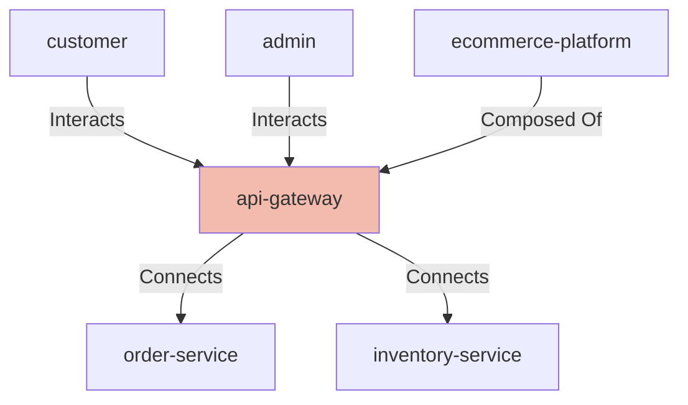

# API Gateway

## Details

    <table>
        <tbody>
        <tr>
            <th>Unique Id</th>
            <td>api-gateway</td>
        </tr>
        <tr>
            <th>Name</th>
            <td>API Gateway</td>
        </tr>
        <tr>
            <th>Description</th>
            <td>Single entry point for all client requests; handles routing, authentication, rate limiting, and load balancing across downstream services</td>
        </tr>
        <tr>
            <th>Node Type</th>
            <td>service</td>
        </tr>
        </tbody>
    </table>

## Interfaces

    <table>
        <thead>
        <tr>
            <th>Unique Id</th>
            <th>Host</th>
            <th>Port</th>
        </tr>
        </thead>
        <tbody>
        <tr>
            <td>api-gateway-https</td>
            <td>api.ecommerce.example.com</td>
            <td>443</td>
        </tr>
        </tbody>
    </table>

## Related Nodes

## Controls
### Performance

API Gateway rate limiting and caching requirements

    <table>
        <thead>
        <tr>
            <th>Key</th>
            <th>Value</th>
        </tr>
        </thead>
        <tbody>
        <tr>
            <td><b>0</b></td>
            <td>
                <table class="nested-table">
                        <tbody>
                        <tr>
                            <td><b>Requirement Url</b></td>
                            <td>
                                https://internal-policy.example.com/performance/rate-limiting
                                    </td>
                        </tr>
                        </tbody>
                    </table>
            </td>
        </tr>
        <tr>
            <td><b>1</b></td>
            <td>
                <table class="nested-table">
                        <tbody>
                        <tr>
                            <td><b>Requirement Url</b></td>
                            <td>
                                https://internal-policy.example.com/performance/caching-policy
                                    </td>
                        </tr>
                        <tr>
                            <td><b>Default Ttl Seconds</b></td>
                            <td>
                                300
                                    </td>
                        </tr>
                        <tr>
                            <td><b>Cache Control</b></td>
                            <td>
                                private
                                    </td>
                        </tr>
                        </tbody>
                    </table>
            </td>
        </tr>
        </tbody>
    </table>

## Metadata

    <table>
        <thead>
        <tr>
            <th>Key</th>
            <th>Value</th>
        </tr>
        </thead>
        <tbody>
        <tr>
            <th>Owner</th>
            <td>platform-team@example.com</td>
        </tr>
        <tr>
            <th>Repository</th>
            <td>https://github.com/example-org/api-gateway</td>
        </tr>
        <tr>
            <th>Deployment Type</th>
            <td>container</td>
        </tr>
        <tr>
            <th>Sla Tier</th>
            <td>tier-1</td>
        </tr>
        </tbody>
    </table>

