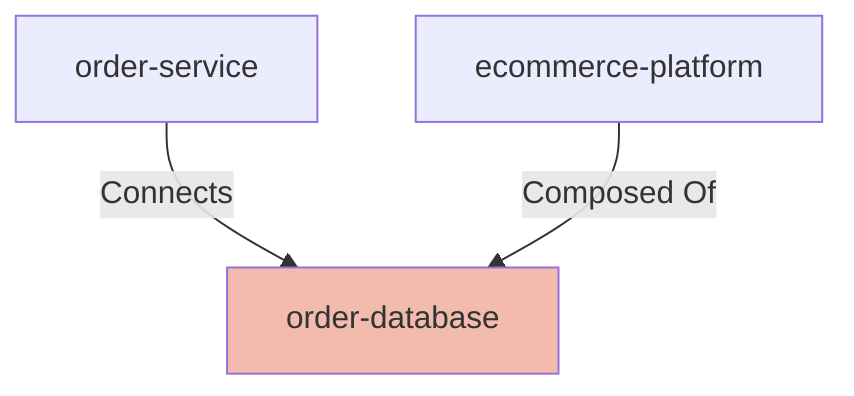

# Order Database

## Details

    <table>
        <tbody>
        <tr>
            <th>Unique Id</th>
            <td>order-database</td>
        </tr>
        <tr>
            <th>Name</th>
            <td>Order Database</td>
        </tr>
        <tr>
            <th>Description</th>
            <td>Primary relational store for order records, order line items, and order status history</td>
        </tr>
        <tr>
            <th>Node Type</th>
            <td>database</td>
        </tr>
        </tbody>
    </table>

## Interfaces

    <table>
        <thead>
        <tr>
            <th>Unique Id</th>
            <th>Host</th>
            <th>Port</th>
        </tr>
        </thead>
        <tbody>
        <tr>
            <td>order-db-connection</td>
            <td>order-db.internal</td>
            <td>5432</td>
        </tr>
        </tbody>
    </table>

## Related Nodes

## Controls
_No controls defined._

## Metadata

    <table>
        <thead>
        <tr>
            <th>Key</th>
            <th>Value</th>
        </tr>
        </thead>
        <tbody>
        <tr>
            <th>Owner</th>
            <td>platform-team@example.com</td>
        </tr>
        <tr>
            <th>Repository</th>
            <td>https://github.com/example-org/order-service</td>
        </tr>
        <tr>
            <th>Deployment Type</th>
            <td>managed</td>
        </tr>
        <tr>
            <th>Engine</th>
            <td>PostgreSQL 15</td>
        </tr>
        </tbody>
    </table>

